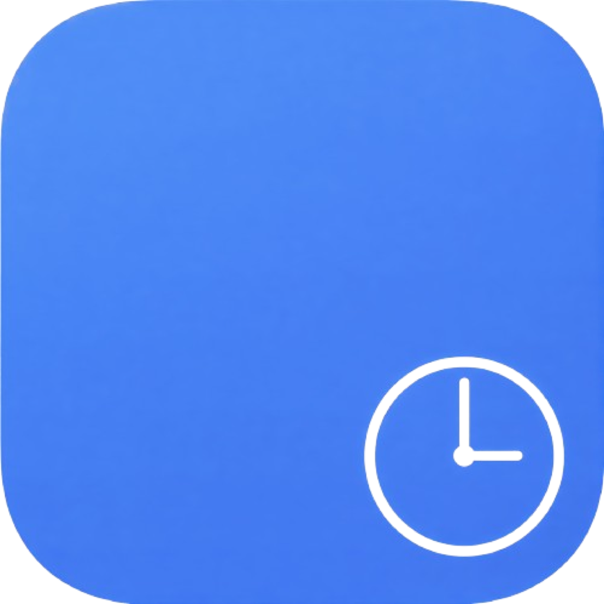

# 🕒 Timely

**Timely** es una aplicación de escritorio minimalista y elegante diseñada para ayudar a los estudiantes a gestionar su horario de clases con precisión y estilo. Construida con **Electron**, **React** y **Vite**, ofrece una experiencia fluida con una estética visual impresionante.



## ✨ Características Principales

- **💎 Estética Glassmorphism**: Una interfaz moderna con fondos líquidos y efectos de cristal que cambian según la hora del día.
- **🔭 Modo Focus**: Una vista simplificada y profesional que resalta la clase actual y el tiempo restante, ideal para presentaciones o estudio profundo.
- **📶 Modo Offline Inmersivo**: Si pierdes la conexión, la app cambia automáticamente a un estilo **Wireframe/Terminal** futurista en blanco y negro.
- **🔔 Notificaciones Inteligentes**: Recibe avisos en tu escritorio cuando comienza una nueva clase.
- **⌨️ Atajos de Teclado**: Maneja toda la aplicación sin tocar el ratón (presiona `?` para ver los atajos).
- **📂 Importación CSV**: Configura tu horario fácilmente importando un archivo `.csv` estándar.
- **🐍 Easter Egg**: Prueba el Código Konami (`↑↑↓↓←→←→ba`) para activar herramientas de depuración.

## 🚀 Instalación y Desarrollo

### Requisitos Previos
- [Node.js](https://nodejs.org/) (versión 18 o superior)
- npm o yarn

### Configuración del Proyecto
1. Clona este repositorio:
   ```bash
   git clone https://github.com/tu-usuario/timely.git
   cd timely
   ```
2. Instala las dependencias:
   ```bash
   npm install
   ```

### Ejecución en Desarrollo
Para ejecutar la aplicación con recarga en caliente (Hot Reload):
```bash
npm run electron:dev
```

### Construcción para Producción
Para generar el ejecutable para tu sistema operativo (Mac, Windows o Linux):
```bash
npm run dist
```

## 📊 Formato del CSV
Tu archivo CSV debe tener los días de la semana como encabezados. La primera columna se utiliza para el rango de tiempo.
Ejemplo:
```csv
Hora,Lunes,Martes,Miércoles,Jueves,Viernes
08:00 - 09:00,Matemáticas,Física,Matemáticas,Historia,Inglés
09:00 - 10:00,Recreo,Recreo,Recreo,Recreo,Recreo
```

## 🛠️ Tecnologías Utilizadas

- **Frontend**: React 18, Tailwind CSS 4.
- **Entorno**: Electron 28, Vite 5.
- **Librerías**: PapaParse (para CSV), PostCSS, Autoprefixer.

## 📄 Licencia

Este proyecto está bajo la **Licencia MIT**. Consulta el archivo [LICENSE](LICENSE) para más detalles.

---
